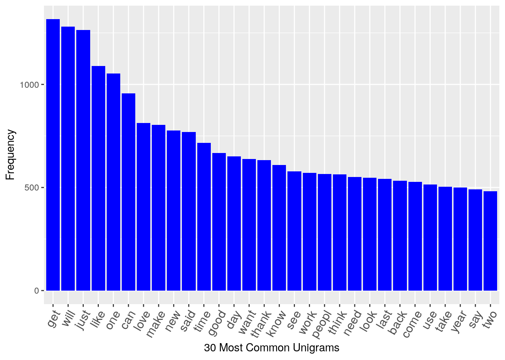
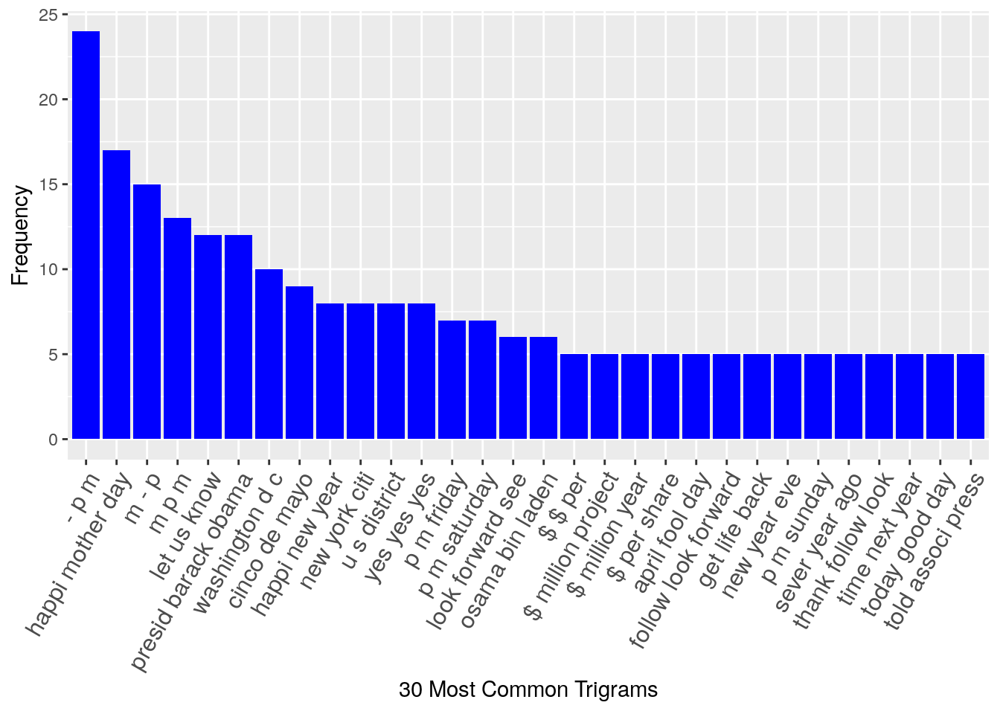

## Sinopsis

This project is to: 1. Demonstrate that I've downloaded the data and have successfully loaded it in.2. Make a summary statistics about the data sets.3. Report any interesting findings that I amassed so far.4. Get feedback on my plans for creating a prediction algorithm and Shiny app. 

## Data Processing

The data processing envolves: 1) download data; 2) summarize; 3) make a sample and 4) Treat the data. During the text I will explain the details of each step. To do this analysis I use this libraries: stringi, tm, ngram, ggplot2, RWeka and SnowBallC.


### 1. Download Data

I downloaded the data according to the instructions of material course. Using the readlines I create three variables for each one of this files: en_US.news, en_US.blogs, en_US.twitter. 


### 2. Summarize Data

Below I summarize the files to identify the size, length lines, longest lines in each files and means words in each files. After the scripts I will describe some insights of each files.  

#### Size in MB


```r
nsize = file.info("/home/fabio/MEGA/CURSOS_ONLINE/datasciencespecialization/capstone-project/data/en_US/en_US.news.txt")$size / 1024 ^ 2
bsize = file.info("//home/fabio/MEGA/CURSOS_ONLINE/datasciencespecialization/capstone-project/data/en_US/en_US.blogs.txt")$size / 1024 ^ 2
tsize = file.info("/home/fabio/MEGA/CURSOS_ONLINE/datasciencespecialization/capstone-project/data/en_US/en_US.twitter.txt")$size / 1024 ^ 2
totalsize = nsize + bsize + tsize
```

#### Length Lines 


```r
nlines = length(news)
blines = length(blogs)
tlines = length(twitter)
totallength = nlines + blines + tlines
```

#### Longest line in each file


```r
nmax = max(stri_count_words(news))
bmax = max(stri_count_words(blogs))
tmax = max(stri_count_words(twitter))
totalmax = nmax + bmax + tmax
```

#### Mean words in each file


```r
nmean = mean(stri_count_words(news))
bmean = mean(stri_count_words(blogs))
tmean = mean(stri_count_words(twitter))
meantotal = nmean + bmean + tmean / 3
```

### Summary

The files that we will use to create a model have aproximatelly 556 mb of texts. Below I print a data.frame that contains the summary of files that I will use. 


```r
names = c("News", "Blogs", "Twitter")
dfsummary = data.frame(Size_in_mb = c(nsize, bsize, tsize),
                        Length_lines = c(nlines, blines, tlines),
                        Longest_line = c(nmax, bmax, tmax),
                        Meanwords = c(nmean, bmean, tmean),
                        Total = c(totalsize, totallength, totalmax), row.names = names)
```


```r
print(dfsummary)
```

```
##         Size_in_mb Length_lines Longest_line Meanwords        Total
## News      196.2775      1010242         1796  34.40997     556.0658
## Blogs     200.4242       899288         6726  41.75107 4269678.0000
## Twitter   159.3641      2360148           47  12.75065    8569.0000
```

### 3. Create Sample File

THe sample file contains 5% of each one files. 


```r
### Create a sample file
set.seed(5150)
sample = c(sample(news, length(news) * .005),
            sample(blogs, length(blogs) * .005),
            sample(twitter, length(twitter) * .005))
```

### 4. Clean and treat data

To treat the data I use the 'tm' package and I remove all the characters that not contribute with the model. 


```r
### Clean and organize data
sample = iconv(sample, 'UTF-8', 'ASCII')
mycorpus = VCorpus(VectorSource(sample))
toSpace = content_transformer(function(x, pattern) gsub(pattern, " ", x))
mycorpus = tm_map(mycorpus, toSpace, "(f|ht)tp(s?)://(.*)[.][a-z]+")
mycorpus = tm_map(mycorpus, toSpace, "@[^\\s]+")
mycorpus = tm_map(mycorpus, tolower)
mycorpus = tm_map(mycorpus, function(x) iconv(enc2utf8(x), sub = "byte"))
mycorpus = tm_map(mycorpus, removeWords, stopwords("english"))
mycorpus = tm_map(mycorpus, stemDocument)
mycorpus = tm_map(mycorpus, removeNumbers)
mycorpus = tm_map(mycorpus, stripWhitespace)
mycorpus = tm_map(mycorpus, PlainTextDocument)
```

## Exploratory Analysis

First I created a getfreq function and using the 'Weka' package to tokenizer two and tri gram.


```r
### Create function to n-grams
getFreq = function(tdm) {
      freq = sort(rowSums(as.matrix(tdm)), decreasing = TRUE)
      return(data.frame(word = names(freq), freq = freq))
}
bigram = function(x) NGramTokenizer(x, Weka_control(min = 2, max = 2))
trigram = function(x) NGramTokenizer(x, Weka_control(min = 3, max = 3))
makePlot = function(data, label) {
      ggplot(data[1:30,], aes(reorder(word, -freq), freq)) +
            labs(x = label, y = "Frequency") +
            theme(axis.text.x = element_text(angle = 60, size = 12, hjust = 1)) +
            geom_bar(stat = "identity", fill = I("blue"))
}

freq1 = getFreq(removeSparseTerms(TermDocumentMatrix(mycorpus), 0.9999))
freq2 = getFreq(removeSparseTerms(TermDocumentMatrix(mycorpus, control = list(tokenize = bigram)), 0.9999))
freq3 = getFreq(removeSparseTerms(TermDocumentMatrix(mycorpus, control = list(tokenize = trigram)), 0.9999))
```

## Conclusion and Next Steps

I show the results in 3 plots that presents the most common words used and the Bigrams and Trigrams. This first version of algorithm need to be improve. My intention in the next step of capstone project is including new stopwords. 






